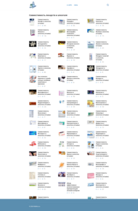
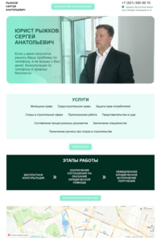
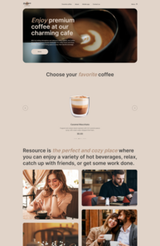
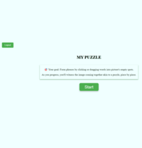
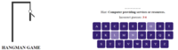
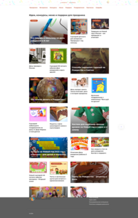

# Hi there 👋

Hi. I’m looking for a job as a frontend developer, available 40 hours a week. I am a programmer since 2009, participating in <a href='https://gordienkogames.itch.io/' target='_blank'>hackathons</a>, leading the channel on <a href='https://www.youtube.com/@GordienkoThings' target='_blank'>development</a>, looking for a company where my skills will be useful.
I’d be happy to discuss the terms!

- 🔭 I’m currently working on a test task on React for one large company.
- 🌱 I’m currently learning React for perfom my skills in RS School.

## Languages and Tools

  &nbsp;
  
  &nbsp;
  &nbsp;
  &nbsp;
  &nbsp;
  &nbsp;
  
  
  
  
  &nbsp;
  &nbsp;
  
  
  &nbsp;
  &nbsp;
  &nbsp;

## My latest projects

  
  
  
  
  
  
  
    

  
### CodeWars
  
  
### My Stats

<!--
### My Courses

 

### Sertificates

  

**guz86/guz86** is a ✨ _special_ ✨ repository because its `README.md` (this file) appears on your GitHub profile.
Here are some ideas to get you started:
- 🔭 I’m currently working on ...
- 🌱 I’m currently learning ...
- 👯 I’m looking to collaborate on ...
- 🤔 I’m looking for help with ...
- 💬 Ask me about ...
- 📫 How to reach me: ...
- 😄 Pronouns: ...
- ⚡ Fun fact: ...
-->
