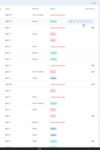
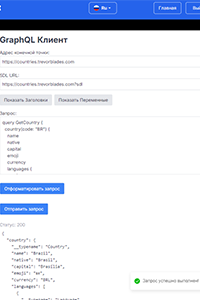
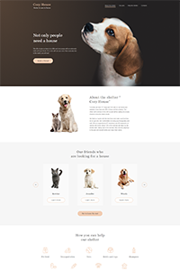

# Hi there 👋

Frontend developer with over 5 years of experience in developing a wide range of applications, from e-commerce websites to complex information systems. I have participated in <a href='https://gordienkogames.itch.io/' target='_blank'>hackathons</a> and led <a href='https://www.youtube.com/@GordienkoThings' target='_blank'>development channel</a>. I am looking for a company where my skills will be valuable, and I would be happy to discuss potential opportunities!

 

   
   

   📫 How to reach me: <a href="mailto:gordienkodev@gmail.com">gordienkodev@gmail.com</a>

- 🚀 I’m currently working on Nova Platform
- 🔭 I’m currently working on a test task on React for one large company.

## Languages and Tools

  &nbsp;
  
  &nbsp;
  &nbsp;
  &nbsp;
  &nbsp;
  &nbsp;
  
  
  
  
  &nbsp;
  &nbsp;
  
  
  &nbsp;
  &nbsp;
  &nbsp;

## My latest projects

  
  
  
  
  
  
  
  

  
### CodeWars
  
  
### My Stats

  

  

<!--
### My Courses

 

### Sertificates

  

**guz86/guz86** is a ✨ _special_ ✨ repository because its `README.md` (this file) appears on your GitHub profile.
Here are some ideas to get you started:
- 🔭 I’m currently working on ...
- 🌱 I’m currently learning ...
- 👯 I’m looking to collaborate on ...
- 🤔 I’m looking for help with ...
- 💬 Ask me about ...
- 📫 How to reach me: ...
- 😄 Pronouns: ...
- ⚡ Fun fact: ...
-->
